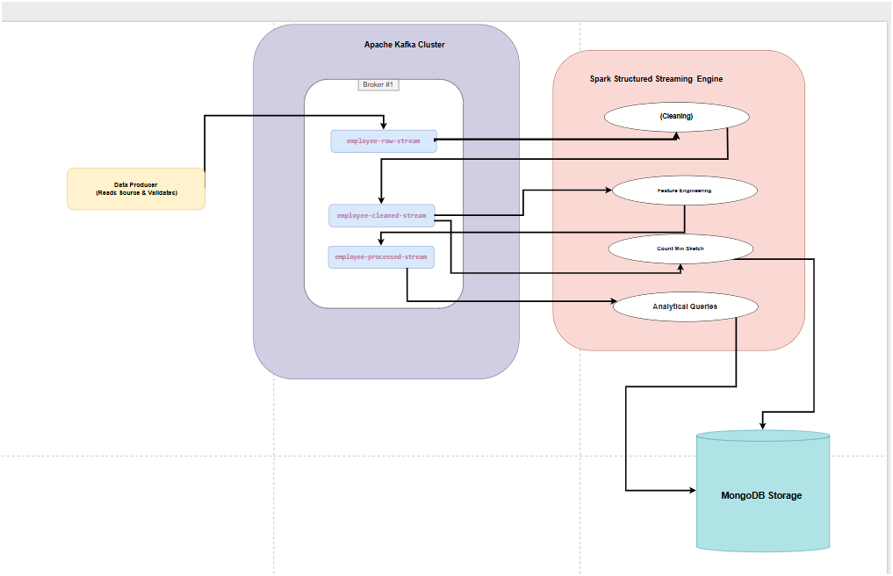
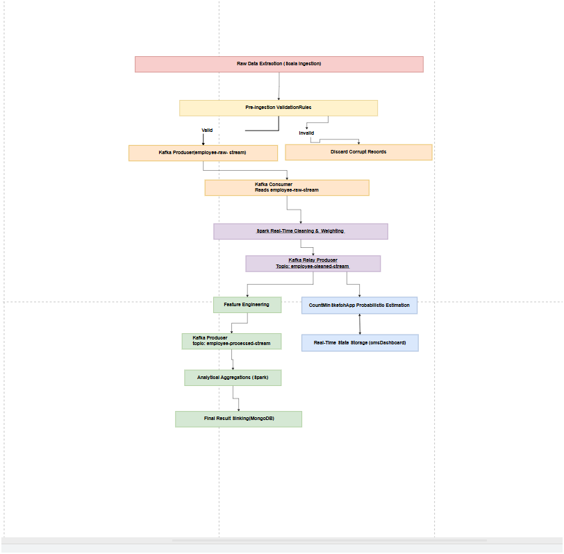

#   RemoteWork Analytics
### Big Data Insights into Mental Health & Productivity

---

## 👥 Team Members
- Dana Morgan
- Suzan Aqraa
- Aisha Saleh

---

## 📌 Project Overview

With the rapid shift toward remote work, understanding its impact on employee mental health and productivity has become critical.

This project applies **Big Data Analytics and real-time stream processing** to analyze large-scale employee survey data, comparing **remote vs. on-site work environments**.

The system identifies patterns related to **stress, social isolation, and productivity**, and generates **feature-rich datasets and real-time trends** that form a **foundation for future predictive modeling and organizational decision-making**.

---
## Big Data Pipeline

### 1. Data Ingestion Flow (The Entry)
* **Component:** `MainIngestion` (Scala Kafka Producer)
* **Process:**
    * Reads raw employee data from the **CSV source** using a memory-efficient iterator.
    * Applies **Validation Rules** (Filtering): Only records with valid ages, stress levels, and work locations are allowed to pass.
* **Destination:** Publishes the validated JSON data to the **`employee-raw-stream`** Kafka topic.
* **Purpose:** Ensures that only high-quality, pre-verified data enters the system.

---

###  2. Real-Time Cleaning Flow (Transformation)
* **Component:** `RawKafkaConsumer` (Spark Structured Streaming)
* **Process:**
    * Subscribes to the **`employee-raw-stream`**.
    * **Data Mapping:** Converts categorical text (e.g., "High", "Medium", "Low") into numerical weights (e.g., 3, 2, 1).
    * **Type Casting:** Ensures all numerical fields (age, hours worked) are correctly typed for mathematical analysis.
* **Destination:** Publishes the refined data to the **`employee-cleaned-stream`** Kafka topic.

---
###  3. Feature Engineering Flow (Intelligence)
* **Component:** `FeatureEngineering` (Spark App)
* **Process:**
    * Takes the "Cleaned" data and calculates advanced behavioral metrics.
    * **Wellbeing Score:** A composite index derived from sleep quality, activity, and balance.
    * **Productivity Impact:** Measures the correlation between work environment and output change.
* **Dual-Destination (The Two-Way Sink):**
    1. **Kafka:** Sends the enriched data to **`employee-processed-stream`** for further reporting.
    2. **Database:** Saves the detailed features directly into **MongoDB** (`employee_features` collection).

---
###   4. Probabilistic Analytics Flow (Optimization)
* **Component:** `CountMinSketchApp` (Advanced Algorithm)
* **Process:**
    * Consumes the **`employee-cleaned-stream`**.
    * Uses the **Count-Min Sketch (CMS)** algorithm to maintain a live, memory-efficient count of stress levels and productivity changes.
* **Destination:** Updates the **`cmsDashboard`** in MongoDB.
* **Purpose:** Allows the system to handle massive datasets with constant memory usage, providing near-instant frequency estimations.

---
###   5. Analytical Aggregation Flow (Reporting)
* **Component:** `StressTrendsQuery` & `WorkModeQuery`
* **Process:**
    * The "final consumers" of the pipeline. They subscribe to the **`employee-processed-stream`**.
    * Perform **Windowed Aggregations**: Calculating average stress levels per day and counting employee distributions across different work modes.
* **Destination:** Stores the final analytical summaries in MongoDB (`stress_trends` and `work_mode`).

---
### 🏛️ 6. Storage  (The Exit)
* **Component:** MongoDB
* **Process:**
    * **Persistence:** All stages of data (Features, CMS counts, and Trends) are stored in NoSQL collections.
---

### 💡 Why this flow is (High Quality):
1. **Decoupling:** By using 3 different Kafka topics, each part of your system can fail or restart without losing data.
2. **Scalability:** Each Spark app can be scaled independently.
3. **Efficiency:** Using CMS means you don't need a massive server to count occurrences in real-time.
4. **Golden Data:** The "Processed" topic provides a single source of truth for all your final queries.
---
## 🏗 System Architecture 

 